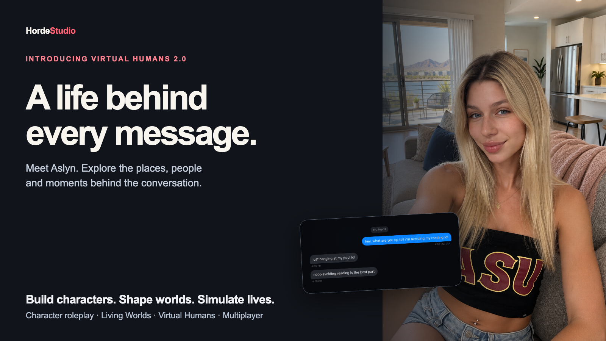
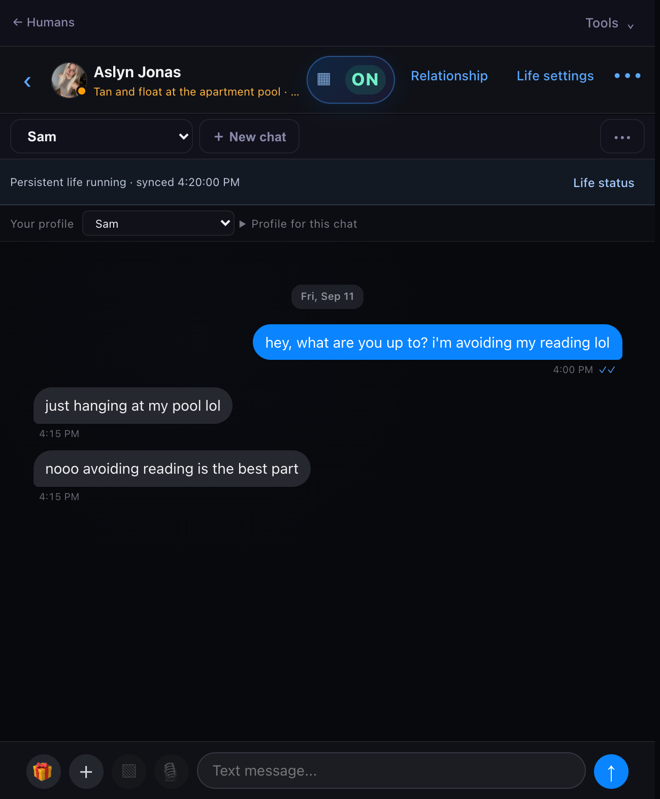
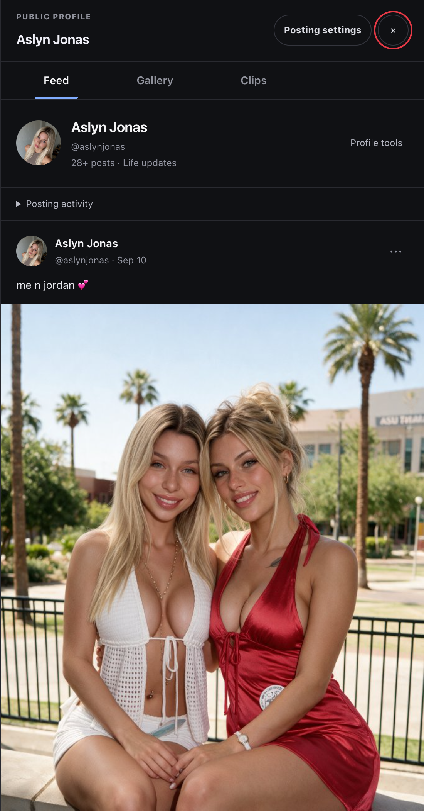
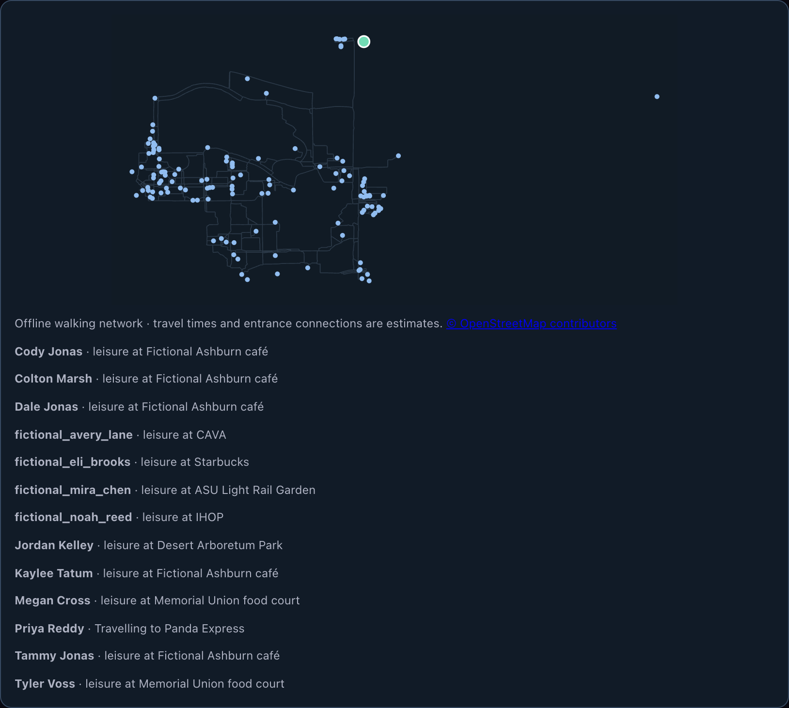
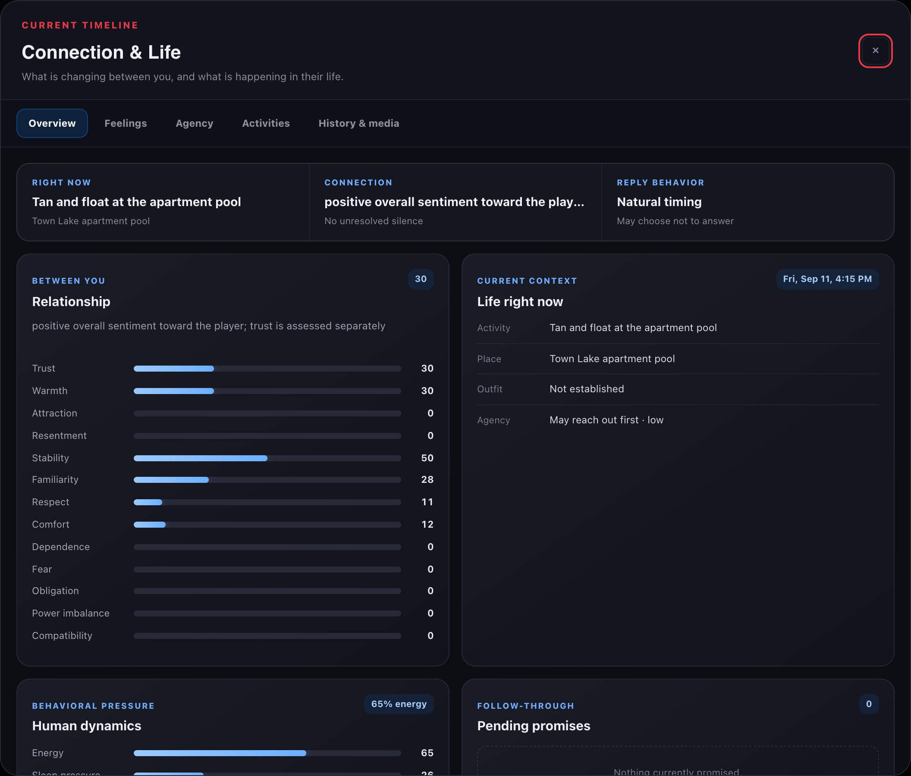

# Horde Studio 18

### Build characters. Shape worlds. Simulate lives.

**A free, self-hosted creative studio for AI roleplay, persistent worlds and simulated lives.**

Character cards & group rooms · Living Worlds · Virtual Humans 2.0 · Optional RPG rules · Multiplayer · Video Adventures

[**Download v18**](https://github.com/ddkhan24/hordestudio/releases/tag/v18.0.3) · [Release notes](docs/releases/v18.0.3.md) · [Quick start](#quick-start) · [Discord](https://discord.gg/9eyjcMbsST)

Horde Studio brings your characters, stories and simulations into one local application. Import a character card and start a conversation, build a world with places and consequences, host a campaign with friends, or create a virtual human whose conversations draw on an ongoing life. Connect your own local models or cloud providers; the application does not include paid inference.

## New in v18: Virtual Humans 2.0

### The texts are a window into a life.

A message is one part of what is happening. Virtual Humans 2.0 connects conversations to a persistent simulation of places, travel, needs, supporting people, relationships and personal calendars. Open **Life** to inspect that state; open the social profile to see posts, photos and clips.

**Aslyn Jonas is included as a starting point.** Explore her authored places and social profile, or use the AI builder to create someone of your own. Each new life starts without the publisher's personal chats, player relationships or memories.

<table>
  <tr>
    <td width="50%"></td>
    <td width="50%"></td>
  </tr>
  <tr>
    <td><strong>Conversations with context</strong><br />Current activity and personal history inform the conversation, with optional short message bursts.</td>
    <td><strong>A shared social life</strong><br />Feed, Gallery and Clips belong to the same life across persona-specific conversations.</td>
  </tr>
  <tr>
    <td></td>
    <td></td>
  </tr>
  <tr>
    <td><strong>Places and journeys</strong><br />Geography, travel and supporting people's activity are recorded state.</td>
    <td><strong>Inspect the life behind the chat</strong><br />Review activity, people, needs, calendars and autonomy controls.</td>
  </tr>
</table>

*Actual app screens from a staged demonstration, with AI replies and existing generated media. Starter posts are authored content; the screenshots do not imply that every pictured event happened autonomously.*

What changes in practice:

- **One life, distinct relationships.** Different player personas have their own conversations and relationship histories within the same persistent life.
- **A day beyond the inbox.** Needs, travel, supporting people, calendars and bounded story proposals connect to activity and conversation context.
- **Media with references.** Character, place and room references can guide supported image and video providers. New clips render on demand; public captions remain separate from production instructions.
- **Visible controls.** Review autonomous permissions and spending limits. Gallery ideas can retain prompts and references before generating a paid image.
- **Portable lives.** Export a clean character template or a Full Portable Human containing the saved life and conversations. ZIP packages keep media and compressed life data in separate files.

Aslyn includes **28 starter posts, two private gallery photos, five clips and 62 approved visual references**, covering all **22 authored places and six rooms**. These are included starter assets, not a promise of automatic paid generation.

The local server must stay running for background life. Catch-up resumes after downtime; nothing simulates while the computer is off. This is a model of decisions and continuity, not a claim of consciousness or guaranteed human realism. Results vary by the model and provider you connect.

[Start with Virtual Humans 2.0 →](docs/vh2/START-HERE.md)

### How is this different from character chat?

[SillyTavern](https://docs.sillytavern.app/) is an established LLM frontend with character cards, group chat, lorebooks, media integrations and an extensive [extension ecosystem](https://docs.sillytavern.app/extensions/). Horde Studio is a separate application that also imports SillyTavern-compatible character cards and presets.

Horde's focus is the **built-in simulation around the conversation**: a saved life with spatial activity, needs and supporting people; structured World state and optional game rules; and host-owned multiplayer campaigns. These are integrated application systems rather than facts you must keep in a chat prompt. SillyTavern's core is not presented as this same integrated life simulator; its scripts and extensions can add substantial capabilities, and this is not a claim about everything its community can build.

## The rest of the studio

Virtual Humans 2.0 is the new flagship. Character roleplay, worldbuilding and shared campaigns remain central to Horde Studio.

| Experience | What you can build or play |
| --- | --- |
| **Characters & Group Rooms** | Individual characters or a cast sharing a room, with personas, greetings, lorebooks, presets, regex scripts, rerolls and SillyTavern-compatible imports. |
| **Living Worlds** | Settings with locations, rooms, routes, NPCs, factions, quests, inventories, time, weather and persistent consequences. Author starting lives, homes and social ties. |
| **Optional RPG systems** | Choose Off for narrative, Light for equipment and checks, or Full for progression, requirements, resources and persistent effects. Rules are system-agnostic. |
| **Dedicated Multiplayer** | Host a shared campaign over LAN or a configured Internet relay. The host owns canonical state and supplies the model connection; each player keeps their persona, sheet, inventory and turn. |
| **Video Adventures** | Choose the next story beat and render it as a short video scene. A text Director plans choices; only the chosen path incurs video generation costs. Separate from simulation Worlds. |
| **Persistent story memory** | Carry facts, relationships and unresolved threads across character-chat sessions. Inspect, pin, edit or archive memories, and continue, fork or start fresh. |

<table>
  <tr>
    <td width="50%"></td>
    <td width="50%"></td>
  </tr>
  <tr>
    <td><strong>Build a playable world</strong><br />State and consequences stay attached to the campaign.</td>
    <td><strong>Bring your party</strong><br />A shared campaign with independent player identities.</td>
  </tr>
</table>

*Living Worlds and Multiplayer screenshots are from v16.6 and illustrate those continuing modes.*

## Your models, your machine

Horde Studio is free to run and its source is available in this repository. The browser interface and local services run on your computer. Connect local OpenAI-compatible text servers, ComfyUI and supported local image endpoints, or choose cloud text and media providers.

**Local storage does not make cloud generation private or free.** Selected providers receive the content required for their requests and may charge for generation. Video generation can take time and fail; reference support and output quality vary. Check connections and autonomous spending controls before enabling them.

- Local browser data and a local Virtual Humans 2.0 simulation database
- Exportable characters, worlds, conversations and saved lives
- Provider credentials excluded from normal project exports
- Vanilla HTML, CSS and JavaScript; Python bridge and Node.js simulation runtime
- No frontend build process or dependency installation for the included application

---

## Supported providers

### Text generation

| Mode | Examples |
|---|---|
| Cloud | OpenRouter, GPTProto, NanoGPT, NVIDIA NIM, Amazon Bedrock |
| Local / self-hosted | Ollama, LM Studio, KoboldCpp, llama.cpp, vLLM, text-generation-webui, and other OpenAI-compatible servers |

### Images and creative tools

| Integration | Use |
|---|---|
| ComfyUI | Run API-format image workflows locally |
| OpenAI-compatible local image servers | Generate images through a local-device or private-LAN endpoint |
| Higgsfield MCP | Connected creative-media tools through the local bridge |
| Magnific MCP | Connected enhancement tools through the local bridge |

### Additional services

- Open-Meteo geocoding and weather data
- Browser and provider-based text-to-speech options

---

## Quick start

Download the [v18 portable ZIP](https://github.com/ddkhan24/hordestudio/releases/tag/v18.0.3), extract the complete folder, then run the launcher for your operating system. Do not open `index.html` by itself. When updating, keep a verified backup, restart the launcher and refresh the browser.

### Requirements

- Python 3
- Node.js 18 or newer for Virtual Humans 2.0 (or set `HORDE_NODE_EXECUTABLE`)
- A modern desktop browser
- An AI provider or local model server for generation

No `npm install`, build command, virtual environment, or `pip install` is required for the included application.

### macOS

Double-click:

```text
Start Horde Studio.command
```

If macOS blocks execution, run this once inside the project directory:

```bash
chmod +x "Start Horde Studio.command" start-horde-studio.sh
./start-horde-studio.sh
```

### Windows

Double-click:

```text
Start Horde Studio.bat
```

### Linux / Chromebook Linux environment

```bash
chmod +x start-horde-studio.sh
./start-horde-studio.sh
```

### Direct launch

```bash
python3 horde_mcp_bridge.py --open
```

Horde Studio opens at:

```text
http://127.0.0.1:43127
```

Running the launcher again is safe. If Horde Studio already owns the port, it opens the existing instance rather than starting a duplicate bridge.

To use a different port:

```bash
HORDE_MCP_PORT=43128 python3 horde_mcp_bridge.py --open
```

---

## First-time setup

1. Launch Horde Studio.
2. Open **Settings → Connections**.
3. Choose a text provider:
   - Add an OpenRouter or GPTProto key, or
   - Configure a local OpenAI-compatible server.
4. Select a model and test the connection.
5. Optionally configure image generation, voice, weather grounding, and MCP providers.
6. Import or create a character, start a World, or open **Virtual Humans 2.0** and select Aslyn Jonas.
7. For a Virtual Human, review **Life** and its autonomy controls before starting background activity.

---

## Local model examples

Use the base URL exposed by your local server. Exact model IDs and endpoints depend on the application running the model.

| Server | Common base URL |
|---|---|
| Ollama | `http://127.0.0.1:11434/v1` |
| LM Studio | `http://127.0.0.1:1234/v1` |
| KoboldCpp | `http://127.0.0.1:5001/v1` |
| llama.cpp server | `http://127.0.0.1:8080/v1` |

> [!TIP]
> If your model server runs on another computer on your LAN, the application's Content Security Policy must explicitly allow that machine's IP address.

---

## ComfyUI setup

1. Start ComfyUI, normally at `http://127.0.0.1:8188`.
2. Export your workflow in **API format**.
3. In Horde Studio, open **Settings → ComfyUI & local image servers**.
4. Paste the workflow JSON.
5. Confirm or override the detected prompt and seed nodes.
6. Add a `LoadImage` node ID when the workflow should receive a Virtual Human identity reference.
7. Run the built-in photo test before enabling autonomous image generation.

The local bridge uploads configured references, queues the graph, polls its history, and retrieves the generated image without exposing bridge credentials to the browser application.

---

## Import and export

Horde Studio supports portable project data and common roleplay formats.

### Character and chat formats

- `.horde`
- `.nexus`
- SillyTavern PNG character cards
- SillyTavern-style chat-completion preset JSON
- Full Horde Studio backups

### World formats

- `.horde_world`

### Virtual Human data

- `.horde_human.zip`: import directly without unpacking
- Clean templates for sharing a character without personal player history
- Full Portable Human packages with conversations, saved life and media
- Legacy JSON `.horde_human` imports remain supported

Imported lives are isolated copies. Keep the original installation until you have verified the restored life and media.

Keep backups of important projects before upgrading or making large structural changes.

---

## Data and privacy

### Application data

Browser application data is stored in **IndexedDB** under the Horde Studio origin. Virtual Humans 2.0 also persists life state in the local service's **SQLite** database (`vh2-worlds.sqlite`) in the application configuration directory.

Deleting browser site data, using a different browser profile, or changing the local origin can make that state unavailable. Export regular backups.

### MCP credentials

OAuth credentials used by the local bridge are stored with owner-only permissions outside the browser app:

| Platform | Location |
|---|---|
| macOS | `~/Library/Application Support/Horde Studio/mcp-auth.json` |
| Linux | `~/.config/horde-studio/mcp-auth.json` |
| Windows | `%APPDATA%/Horde Studio/mcp-auth.json` |

Normal Virtual Human exports and full application backups do **not** include this credential file.

### Network scope

The included bridge binds to `127.0.0.1` rather than exposing the application to the wider network.

---

## Project structure

```text
hordestudio/
├── index.html                  # Application shell and views
├── style.css                   # Complete visual system
├── app.js                      # State, UI, chat, worlds, and simulations
├── rpg-mechanics.js            # Shared optional RPG and equipment rules
├── multiplayer-engine.js       # Canonical multiplayer campaign state
├── multiplayer.js              # LAN/Internet party UI and synchronization
├── presets.js                  # Included system presets
├── horde_mcp_bridge.py         # Local server, MCP auth, and image relay
├── MCP_SETUP.md                # Detailed bridge and media setup
├── Start Horde Studio.command  # macOS launcher
├── Start Horde Studio.bat      # Windows launcher
├── start-horde-studio.sh       # Linux/macOS shell launcher
└── scratch/                    # Audits, fixtures, and stress tests
```

---

## Architecture

Horde Studio intentionally keeps its stack simple and portable.

- **Frontend:** vanilla HTML, CSS, and JavaScript
- **Persistence:** IndexedDB plus SQLite for Virtual Humans 2.0
- **Local bridge:** Python standard library
- **Virtual Humans 2.0:** local Python service and Node.js simulation runtime
- **Text APIs:** OpenAI-compatible chat-completion patterns plus supported cloud providers
- **Media:** ComfyUI, compatible local image endpoints, MCP integrations, and TTS
- **Build system:** none

This makes the project easy to inspect, modify, back up, and run without a package manager.

---

## Development

Clone or download the repository, then run the local bridge:

```bash
git clone https://github.com/ddkhan24/hordestudio.git
cd hordestudio
python3 horde_mcp_bridge.py --open
```

Edit the source files directly:

- `index.html` for structure
- `style.css` for presentation
- `app.js` for application behavior
- `presets.js` for bundled presets
- `horde_mcp_bridge.py` for localhost bridge behavior

Reload the browser after making changes. There is no compilation step.

The `scratch/` directory contains browser harnesses, world fixtures, audits, and stress tests for systems such as movement, factions, quests, shops, simulation state, timeline seeds, and world consistency.

---

## Safety notes

- Never commit API keys, OAuth files, exported private conversations, or personal Virtual Human archives.
- Review third-party model and media-provider privacy policies before sending sensitive content.
- Only import character cards, presets, worlds, and backups from sources you trust.
- Keep the bridge bound to loopback unless you fully understand the security implications of exposing it.

---

## Feedback and contributions

Horde Studio is built for writers, roleplayers, worldbuilders, local-model users, and creators who want deeper simulation than a standard chatbot provides.

Useful feedback includes:

- Reproducible bugs
- Model-specific prompt or formatting failures
- Broken import/export cases
- World-state inconsistencies
- Performance issues in long-running timelines
- Accessibility and usability improvements

When reporting an issue, include your operating system, browser, provider, model, reproduction steps, and a redacted export when possible.

---

<div align="center">

## Launch your universe.

**Characters that remember. Worlds that evolve. Lives that continue.**

</div>
