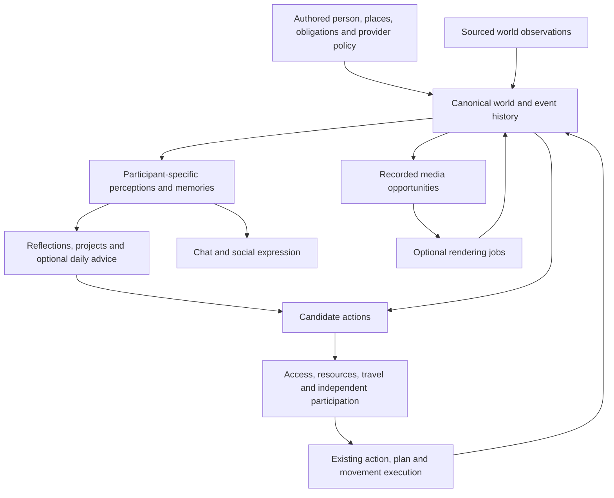

# Horde virtual life: architecture and simulation comparison

## Assessment

Horde has the foundations of a persistent person simulation: one authoritative world, physical movement, needs, independent supporting people, reciprocal plans, relationships, remembered experiences, personal dates, and optional expression through chat and media. Its strongest direction is to deepen the connections between these systems. Replacing them with an unrestricted storyteller would make the life less consistent.

The largest remaining gap is **development over time**. The current character can change immediate preferences and relationships, and the daily adviser can suggest concrete activities. It does not yet acquire an open-ended repertoire of verified skills, develop rich long-running projects from experience, or maintain a general model of what each person believes about every relevant situation. These are engineering and evaluation gaps, not reasons to add a second scheduler.

Version 18 can be evaluated as a reliable, engaging fictional person simulator. It cannot be certified as conscious, psychologically equivalent to a human, indistinguishable from a real person, or universally accurate across cultures. None of the reference projects establishes those claims either. Believable conversation, valid simulation mechanics, and behavioral fidelity require different evidence.

This assessment covers the working source tree inspected on 13 September 2026, based on commit `520aa21` plus the current working changes. Source-level findings are distinguished from previously documented test results. The companion release audit must verify the final packaged build and actual embedded character; this comparison does not certify that artifact.

## What to borrow

There is no defensible single ranking of the “best” life simulator: these systems optimize different outcomes. The useful comparison is by mechanism and fit with Horde's intended experience.

| Reference | Demonstrated or documented mechanism | Appropriate transfer to Horde | What the evidence does not establish |
| --- | --- | --- | --- |
| **Generative Agents / Smallville** | Experience memory, retrieval, reflection and planning; an interactive community of 25 agents. | Better retrieval of relevant experiences and source-linked social reflection. | Lifelong human equivalence or an unrestricted city. |
| **Concordia** | Agents propose actions; a game master resolves the environment; entities use configurable components. | A clear proposal → validation → outcome boundary and reusable scenario definitions. | That arbitrary narrative outcomes are true or physically valid without appropriate constraints. |
| **AI Town** | Shared transactional state, a tick engine, asynchronous agent operations, conversation memory. | Durable work submission, explicit pending state, and consistency between chat and physical action. | Detailed physiology, relationships or real-world behavioral validity. |
| **AgentSociety** | Urban mobility, social and economic interaction, and large-scale experiments. | Measurement, interventions and scalable population abstractions. | That more agents make a single companion more convincing. |
| **AgentSociety 2** | Configurable agent environments and an integrated experimental workflow. | A reproducible scenario/measurement catalog. | That a research orchestration platform should become Horde's runtime. |
| **Project Sid / PIANO** | Concurrent processing coordinated through shared state and a high-level controller. | Common action context across speech, social behavior and movement. | Consciousness or a confirmed reusable open-source release of the complete system. |
| **Voyager** | A curriculum, reusable executable skills, feedback and verification. | Reusable, verified compositions of existing life actions. | General human learning, or safe unrestricted runtime code generation. |
| **Reflexion** | Experience feedback stored as reflective language to improve later attempts. | Specific lessons from actual failures, with expiry and provenance. | Reliable self-correction merely because an LLM critic sounds confident. |

### Generative Agents: memory must change future choices

The original system combines an experience stream with memory retrieval, higher-level reflection and plans that respond to observations. Its experiments include component ablations and a two-day simulated community. The paper also reports retrieval failures, fabricated embellishments and an overly formal style. These are directly relevant to a companion whose texts should reveal a life rather than manufacture one. [Park et al., 2023](https://arxiv.org/html/2304.03442v2)

The repository provides the research implementation and replayable examples. It is a useful reference for memory and plan decomposition, but its original deployment arrangement is not a production reliability standard for Horde. [Generative Agents repository](https://github.com/joonspk-research/generative_agents)

**Recommendation:** retain Horde's immutable events and add richer retrieval and interpretation above them. Reflection should carry the events that support it, confidence, whose perspective it belongs to, and what would change the interpretation. “Jordan may prefer quieter evenings” must remain an inference, not become a new personality fact after one declined invitation.

### Concordia: freedom needs an outcome authority

Concordia separates actors from an environment-resolving game master. Its component architecture makes physical, social and digital scenarios configurable. Its later design paper distinguishes simulation, drama and evaluation purposes; this is useful when deciding how much a story-pacing setting may influence life. [Concordia repository](https://github.com/google-deepmind/concordia), [Vezhnevets et al., 2025](https://arxiv.org/abs/2507.08892)

**Recommendation:** an LLM may propose trying an unfamiliar activity, preparing a trip or inviting someone. The existing Horde owners should validate access, resources, travel, attention and independent participation. The resulting event is authoritative; the proposal is not. Keep story pacing as a source of opportunities, with ordinary continuity as a valid outcome.

### AI Town: asynchronous work must return to the same world

AI Town documents a shared global state and transactional simulation. Its architecture keeps long-running agent operations outside the tick and submits their results back through simulation inputs. Conversation summaries are embedded for later retrieval. It also describes active-state size constraints. [AI Town repository](https://github.com/a16z-infra/ai-town), [architecture](https://github.com/a16z-infra/ai-town/blob/main/ARCHITECTURE.md)

**Recommendation:** preserve Horde's existing provider-job and command architecture. A late model response must be checked against the relevant person, setup, conversation and source moment. It must not silently replace a newer decision. A visible status should describe whether work is queued locally, submitted to a provider, ready, failed, or uncertain.

### AgentSociety: measure populations without confusing scale with intimacy

The original AgentSociety study reports over 10,000 agents and five million interactions in a social environment, with experiments involving social and economic interventions. That is a different objective from making one companion's ordinary afternoon meaningful. [Piao et al., 2025, original version](https://arxiv.org/abs/2502.08691v1)

The current repository distinguishes the original city simulator from AgentSociety 2. The latter supports multiple reasoning patterns and a replayable experimental workflow. Its license statement excludes a commercial subdirectory from the general Apache 2.0 grant, so reuse must be assessed per component. [Current repository documentation](https://raw.githubusercontent.com/tsinghua-fib-lab/AgentSociety/main/README.md)

AgentSociety 2's paper describes coupling experiment orchestration with simulated participants across seven illustrative studies. It is a useful example of making interventions and measurements explicit, rather than treating an interesting transcript as the whole evaluation. [Piao et al., 2026](https://arxiv.org/abs/2607.11895)

**Recommendation:** borrow the experimental discipline. Evaluate a manageable network around the character, then use coarser representations for distant people and crowds. Instantiate an independent actor when someone becomes causally relevant. Keep a stable identity when that actor returns to the background.

### Project Sid: simultaneous channels need coherent decisions

PIANO uses concurrent modules with shared agent state and a high-level decision controller; its paper identifies incoherence between speech and action as a central problem. The Minecraft experiments report large agent societies, while acknowledging limitations in spatial skills and innate drives. [Project Sid, 2024](https://arxiv.org/html/2411.00114v1)

**Recommendation:** use a shared, revisioned account of current intentions, position, availability and known events for every output. Chat saying “I am home,” a map showing a journey, and a photo claiming a different location must not arise from independent accounts of reality. The paper is an architectural reference; a reusable public release of its entire implementation was not established here.

### Voyager and Reflexion: learning needs executable evidence

Voyager combines automatic task selection, a reusable library of executable skills and iterative feedback. Its learning does not require updating model weights. Its reported generalization is within Minecraft. [Voyager repository](https://github.com/MineDojo/Voyager)

Reflexion stores verbal feedback from previous attempts for later decisions. Its benchmark results concern tasks such as coding and sequential decision-making, not the validity of a person's emotions or relationships. [Shinn et al., 2023](https://arxiv.org/abs/2303.11366), [implementation](https://github.com/noahshinn/reflexion)

**Recommendation:** a character could discover that a short home workout fits a busy morning, or that a particular invitation works better with advance notice. Save a lesson only after its relevant outcome exists. Represent reusable activities as bounded compositions of supported actions, not arbitrary JavaScript or Python produced by the character.

## What Horde currently implements

The following inventory is based on current source, not on feature names alone.

| Area | Current implementation | Practical boundary |
| --- | --- | --- |
| Canonical authority | `vh2_runtime.py` commits events, maintains revisions and evaluates the shared kernel. `vh2-kernel-worker.js` orders the subsystem updates. | A shared event store still needs migration, concurrency and recovery tests; it does not automatically eliminate all conflicts. |
| Choice and interruption | `vh2-decision-engine.js` selects feasible candidates with seeded probabilities, urgent-need filtering, minimum hold time and reconsideration. The kernel adds experience, intentions, reflections, health and story preferences to scoring. | Choice remains within available actions and authored effects. Random variation alone is not meaningful emergence. |
| Spatial life | Geography, travel, transport and participant modules maintain position, journeys, access and resources. Supporting people have independent actions and needs. | The world is only as complete as its places, routes, capabilities and actor setup. A map label is not a simulated interior. |
| Reciprocal social behavior | `vh2-plans-engine.js` supports calls, shared activity, hosted events, event outings, private visits, independent responses, attendance and departure. | This is a bounded plan vocabulary, not arbitrary group behavior or detailed crowd simulation. |
| New acquaintances | `vh2_population.py` can seed stable fictional residents using allowed homes and public places. Introductions require actual overlap and separate approach/response draws. | Seeded residents are limited and use a small name/description vocabulary. Continuous contextual population development is not established. |
| Relationships | Per-person relationship state, observed participation, lifecycle transitions and bounded conversation appraisal exist. | Numeric changes and labels are simulation parameters, not validated attachment or personality models. |
| Experience learning | `vh2-psychology-engine.js` updates opportunity preferences from completed/missed goals and creates place reflections from recent episodes. Supporting people also retain experience. | Reflections predominantly aggregate place outcomes; they are not a general social or autobiographical reasoning system. |
| Memory access | `WorldService.recall` ranks eligible stored episodes by lexical matches and a small current-place bonus, returning up to eight. | Paraphrases without shared words and socially relevant episodes without place overlap may be missed. There is no general semantic retrieval in this path. |
| Daily direction | `vh2_story.py` supplies a bounded, source-linked daily adviser; `vh2-story-engine.js` can turn up to three flexible solo suggestions into ordinary optional goals. | Its seven new-task categories do not create arbitrary skills, institutions, bookings or social outcomes. Tentative advice is not completed history. |
| Calendar | Personal dates, recurring obligations, terms and breaks feed context and activity constraints. | A known birthday or match does not prove a party, attendance or a gift. Academic term completion is not graduation. |
| Health and emotion | Persistent fictional discomfort episodes, recovery, needs, affect decay and bounded appraisals exist. | These are authored approximations. The illness hazard and numeric emotional effects have no demonstrated medical or clinical calibration. |
| Chat awareness | `expression_context` includes present activity/movement, intentions, calendar, remembered events, social posts, noticed reactions, finances, possessions, known claims and other-contact awareness. | Correct input does not guarantee that every provider's reply will remain grounded. Knowledge must stay perspective-specific. |
| Media | Social and clip records carry status and provenance; recorded photos can use frozen capture context. Gallery ideas can be retained before paying to render. | A rendered depiction does not establish a new event. All export/import media references must survive outside the original machine. |

The code paths are available in the [runtime](../../vh2_runtime.py), [kernel](../../vh2-kernel-worker.js), [decisions](../../vh2-decision-engine.js), [plans](../../vh2-plans-engine.js), [psychology](../../vh2-psychology-engine.js), [population](../../vh2_population.py), [adviser](../../vh2_story.py), [story activities](../../vh2-story-engine.js), and [health model](../../vh2-health-engine.js).

The earlier [procedural realism audit](procedural-realism-audit-20260912.md) identified missing participant and social transitions. Those findings must not be repeated as current without checking the subsequent [delivery](realism-delivery-20260912.md) and current code. Hosted gatherings, persistent residents, reciprocal calls, group attendance and private follow-ups now have implementations and regression fixtures. Conversely, their existence does not prove that every authored character has the required configuration.

## Gaps that most affect believable life

### 1. Experience interpretation is shallow compared with the event history

Current place reflections compute recency-weighted appraisal values. This can help choose a café or familiar activity, but it does not explain a disagreement, distinguish a friend's unavailability from disinterest, or preserve a changing ambition across several weeks. An archive can grow indefinitely while the character's accessible understanding remains shallow.

**Bounded implementation:** extend the existing psychology state with source-linked reflections about people, recurring goals and action outcomes. Store the subject, evidence IDs, tentative conclusion, confidence, counterevidence and review time. Do not create a separate memory truth store. A reflection can influence a choice within existing budgets; it cannot establish someone else's motives or edit past events.

**Acceptance:** repeated reliable behavior can alter an expectation; one ambiguous cancellation cannot establish hostility. New conflicting evidence reduces confidence. A replay reproduces the accepted reflection state, and private evidence remains unavailable to uninvolved participants.

### 2. Memory retrieval needs meaning as well as matching words

The present lexical recall is deterministic and inspectable, but “Who has been there for you?” may not retrieve an episode phrased as “Jordan brought dinner after the missed appointment.” This is a concrete cause of chat feeling detached from a rich underlying life.

**Bounded implementation:** first add stable person/goal/activity tags and query expansion from known aliases. Then evaluate an optional embedding index over the same eligible episodes, with a local or configured provider and cached vectors. Re-rank with relevance, source quality and recency while preserving diverse evidence. The index must be disposable and rebuildable; canonical episodes remain authoritative.

**Acceptance:** a paraphrase benchmark retrieves the same relevant evidence without leaking another persona's private conversation. Deleted or unavailable episodes never reappear from a stale index. Missing embeddings degrade to lexical recall without stopping life or spending repeatedly.

### 3. Long-running projects need visible progress and reasons to change

A daily intention to study or prepare a trip is useful. A person also has projects that survive an interrupted afternoon: finishing an assignment, saving for travel, repairing a friendship or learning a hobby. The current adviser does not establish a general project lifecycle with success evidence, dependencies and revision history.

**Bounded implementation:** extend existing goals with optional parent project IDs, measurable milestones, a next feasible step, resource requirements, priority and reconsideration criteria. Daily advice may propose or revise a project; the normal engine executes steps. A progress receipt must cite actual completion or explicitly authored fictional outcomes.

**Acceptance:** projects survive restart, pauses and missed windows; progress does not advance because a caption or model summary says it did. Lack of funds or access produces a meaningful alternative. A new desire can displace a project without silently deleting its history.

### 4. Self-expansion currently means setup seeding, not an open world

The current fictional generator produces a bounded local population from existing places. It does not establish unlimited neighborhoods, cultural variety, new occupational structures, or self-authored activity semantics. Increasing the population limit would mostly increase repetition unless world and personality detail grow with it.

**Bounded implementation:** expand only when there is a concrete unmet opportunity: a hobby needs a venue, a recurring background person becomes a friend, or travel introduces a new region. Proposals should identify existing geography where possible and mark fictional residents, interiors and occasions explicitly. Commit a complete minimal actor/place package through the existing builder and validators, once per stable identity.

**Acceptance:** revisiting a café retains the same relevant people; generating a new resident does not refill funds or duplicate a home. Locale-aware authoring must come from actual setting detail rather than name, nationality or poverty stereotypes. No generated private address becomes a claim about a real resident.

### 5. Learning should generalize across activities without rewriting the engine

The present preference update is genuine bounded adaptation, but much of the appraisal comes from authored goal effects. It should not be described as an unconstrained self-learning mind. A more useful next step is learning which combinations of existing actions work under particular conditions.

**Bounded implementation:** store declarative activity recipes made from approved verbs and existing preconditions. Track attempts, completion, interruption, cost and context. Promote a recipe into ordinary candidate selection after successful execution; demote or suspend it when repeated failures reveal invalid assumptions. Keep exploration modest so ordinary obligations and rest remain possible.

**Acceptance:** a recipe must execute in a second compatible situation, fail cleanly when its prerequisites are absent, and never declare itself successful. Learning cannot grant access, create money, infer intimacy, or call external services outside the chosen provider policy.

### 6. Supporting people need richer continuing perspectives

Supporting actors already occupy space and participate independently. Believability still depends on their continuity beyond being available for the main character. Their interests, remembered interactions and ongoing obligations should affect offers and responses in ways the main character can discover over time.

**Bounded implementation:** reuse the same project and reflection structures for relevant supporting people, with lower update frequency when distant. Introduce knowledge through actual observation, conversation or a noticed post. Give them their own explanation for a decline without exposing private state directly.

**Acceptance:** changing only a friend's obligations changes their availability and some outcomes. The main character cannot know why they declined unless told or reasonably inferred. Friends can meet without the main character and later disclose selected information through ordinary communication.

### 7. Empirical and experience evaluation is missing from a pure test count

A unit test proving an invitation can be accepted does not show that the rate, timing or language feels believable. A stress test with no crashes does not measure whether every evening repeats. A model can be consistent and still generic.

A study of 1,052 Americans found that personal interview and survey evidence improved held-out behavioral predictions relative to demographic descriptions. Its latest results are normalized against participants' own test-retest consistency, not a percentage measure of being human. It does not validate fictional companion relationships. [Park et al., revised 2026](https://arxiv.org/abs/2411.10109)

Recent methodological work warns that fluency and plausible local behavior can obscure failures in larger social simulations. It recommends evaluating environmental, individual, interaction and aggregate behavior separately. [Taillandier et al., revised 2026](https://arxiv.org/abs/2507.19364)

**Bounded implementation:** maintain blind human reviews of grounded transcripts and life traces alongside deterministic tests. Compare the full system with simpler versions: no learned preferences, no daily adviser, no independent peers. A mechanism is useful when its effect improves the intended experience, not merely because more events were emitted.

## The intended scenarios

| Scenario | What can be supported by current mechanisms | What still requires restraint or added depth |
| --- | --- | --- |
| A friend suggests a Friday gathering; the character meets someone and leaves independently | Hosted plans, invitations, routes, introductions, independent private-visit choices and return intentions have a connected regression fixture. | A successful seeded branch is evidence of possibility, not a guarantee of natural frequency. Emotional interpretation of leaving a friend remains much simpler than human social reasoning. |
| A football outing with friends | Noticed events can create outings with participants and actual attendance. Media can be attached to a recorded moment. | Admission, correct event/venue configuration, suitable capture context and successful providers still matter. A listing or photograph cannot substitute for attendance. |
| Lonely at home, deciding whether to call or invite someone | Needs and known contacts can produce reciprocal calls or social proposals; recipients may decline. | A long-term change in coping style or an evolving support network needs richer learning and evidence. |
| A hot afternoon swim or home workout | Weather, established place capabilities, access, health and needs influence feasible choices. | This is a bounded utility model, not a full account of human motivation. |
| A relationship with friendship, romance or an adult intimate dimension | Per-person relationship state, boundaries and independent decisions can coexist with the character's own life. | No label should force participation. Attachment style, emotional complexity and long-term relationship quality need separate evaluation. |
| A creator, traveler or person facing difficult circumstances | Authored context, finances, calendars, places, travel, social expression and tentative advice can shape the day. | Arbitrary institutional decisions, war developments, abuse, migration or career progress cannot be improvised as facts by a narrator. General cultural and situational authenticity is not certified. |

The relevant party and event fixture is [social participation](../../scratch/vh2_social_participation_audit.js). It checks a possible connected branch, partial refusal, departure, privacy and return. The final release evidence should record whether that fixture and its surrounding service tests pass on the exact shipped kernel.

## One connected architecture

The recommended system remains one simulation with several inputs and views:

The same event should explain the map, relationship evidence, remembered experience and any later post. Different people can know different parts of it. “All systems connected” should mean common IDs and ownership with explicit perspective filters, not that every agent receives every private fact.

The builder should output a complete executable starting package: person, relationships, supporting lives, homes, activities, possessions, calendar, geography assumptions, references and autonomy policy. Incomplete sections should have useful review messages at creation time. The builder should not fill missing relatives, marriages, traumatic histories or permissions merely to satisfy a schema.

For the interface, the most valuable summary is simple: what the person is doing, what they currently intend, what changed recently, and whether life is running. The internal causal trace belongs in an inspector. Media status and cost controls belong beside the relevant photo or clip, with free saved ideas clearly distinguished from requested renders.

## Release gates for version 18

These are acceptance criteria, not a claim that the final package has passed them.

| Gate | Required evidence |
| --- | --- |
| One genuine embedded character | Stable identity and version marker; exactly one default entry on a fresh install and on upgrade. Saved edits are preserved, and a stale duplicate cannot reinstall itself. |
| Complete portable media | A manifest accounts for every included gallery photo, reference, starter post and clip. Media are binary package entries with checked hashes and sizes; no browser-sized base64 JSON string or machine-local dependency. |
| Export/import round trip | Export the real large character package, import into isolated clean storage, verify references and media resolution, then export again without duplicates or missing assets. |
| Ongoing life | Advance multiple seeds and settings through at least several days; verify no teleportation, simultaneous incompatible attendance, impossible resource creation, permanent idle lock or unresolved expired activity. |
| Reciprocal social life | Independent accept/decline/counter behavior, actual co-presence, partial attendance, returns, known-person persistence and private information boundaries. |
| Learning behavior | Hold the seed and options fixed while changing prior experience; verify a bounded, explainable difference in later choice. Changed evidence can reverse an earlier preference. |
| Chat grounding | Ask about recent and old events, plans, birthdays, social reactions and other contacts. Responses must distinguish completed, intended, inferred, reported and unknown information. |
| Background reliability | Close the browser, interrupt the host, resume, catch up, and reject stale results. No duplicate spending or fabricated successful import after an uncertain provider outcome. |
| UI completion | Fresh-user flow: select default person → start chat → inspect life → open feed/gallery/clips → change settings → export/import. Verify feedback and narrow-screen layout. |
| Long-run quality | Quantify repeated-action loops, unresolved goals, activity variety, relationship drift, ungrounded statements, simulation lag and provider cost. Review the actual traces, not only aggregate totals. |

A useful test matrix combines quiet/social, low/high funds, local/remote contacts, healthy/unwell, complete/temporarily blocked geography, and paused/running providers. Reuse the same canonical command and event path in fixtures. For provider variability, separate deterministic contract tests from a small explicitly budgeted live evaluation.

## Implementation priority

1. **Finish release correctness first.** Verify the actual embedded package, duplicate identity removal, large binary export/import, life startup and recovery. These are release blockers irrespective of simulation sophistication.
2. **Improve recall and social reflection.** They offer the most direct improvement to texts feeling like a window into an existing life, while using the current event history.
3. **Add persistent projects and verified activity recipes.** These turn experience into development beyond today's choice of venue.
4. **Expand relevant people and places progressively.** Use stable identities, complete executable setup and explicit fictional provenance.
5. **Calibrate and review across distinct lives.** Use diverse authored contexts and blind experience review before making broader realism claims.

The release description should distinguish what is implemented from what remains exploratory. An accurate claim is: **a persistent fictional person with a spatial life, independent social participation, bounded adaptive preferences, and conversation grounded in recorded experience**. “Self-learning” should name the specific learned state. “Self-expanding” should identify the bounded content it can create. Neither phrase should imply consciousness, unrestricted self-modification or guaranteed human equivalence.

## Sources and evidence

All external sources below were accessed on 13 September 2026. Repository defaults are moving targets; dates for papers refer to the specified publication or revision. A repository's general license does not establish rights to every bundled asset or third-party dependency.

1. Park, Joon Sung et al. **Generative Agents: Interactive Simulacra of Human Behavior.** 2023. [Paper](https://arxiv.org/html/2304.03442v2); [primary implementation](https://github.com/joonspk-research/generative_agents). Memory, reflection, planning, ablation and reported failure modes.
2. Google DeepMind. **Concordia.** Current repository documentation. [Repository](https://github.com/google-deepmind/concordia). Entities, components, action proposals and environmental resolution; repository identifies Apache 2.0.
3. Vezhnevets, Alexander Sasha et al. **Multi-Actor Generative Artificial Intelligence as a Game Engine.** 10 July 2025. [Paper](https://arxiv.org/abs/2507.08892). Simulation, drama and evaluation purposes; component design.
4. a16z-infra / AI Town contributors. **AI Town.** Current repository and architecture documentation. [Repository](https://github.com/a16z-infra/ai-town); [architecture](https://github.com/a16z-infra/ai-town/blob/main/ARCHITECTURE.md). Shared transactions, asynchronous operations, memory and stated engine limitations; repository identifies MIT.
5. Piao, Jinghua et al. **AgentSociety: Large-Scale Simulation of LLM-Driven Generative Agents Advances Understanding of Human Behaviors and Society.** Original version, 12 February 2025; a later revision is listed. [Version 1](https://arxiv.org/abs/2502.08691v1). Original scale and experimental scope.
6. Tsinghua FIB Lab. **AgentSociety repository documentation.** Current. [README](https://raw.githubusercontent.com/tsinghua-fib-lab/AgentSociety/main/README.md). Explicit distinction between versions 1 and 2, architecture and license exception.
7. Piao, Jinghua et al. **AgentSociety 2: An Integrated Research Environment for Executable Social Science.** Latest listed revision 15 July 2026. [Paper](https://arxiv.org/abs/2607.11895). Experimental workflow and study scope.
8. Altera.AL et al. **Project Sid: Many-agent simulations toward AI civilization.** 31 October 2024. [Paper](https://arxiv.org/html/2411.00114v1). PIANO coherence design, Minecraft scope and limitations. No complete reusable public implementation was verified.
9. Wang, Guanzhi et al. / MineDojo. **Voyager: An Open-Ended Embodied Agent with Large Language Models.** 2023; current repository. [Repository](https://github.com/MineDojo/Voyager). Curriculum, executable skills and feedback; repository identifies MIT.
10. Shinn, Noah et al. **Reflexion: Language Agents with Verbal Reinforcement Learning.** Latest listed revision 10 October 2023. [Paper](https://arxiv.org/abs/2303.11366); [repository](https://github.com/noahshinn/reflexion). Reflective feedback without weight updates.
11. Park, Joon Sung et al. **LLM Agents Grounded in Self-Reports Enable General-Purpose Simulation of Individuals.** Revised 28 June 2026; originally published under *Generative Agent Simulations of 1,000 People*. [Latest paper](https://arxiv.org/abs/2411.10109). Individual evidence and held-out behavioral evaluation; normalized results must not be interpreted as a human-equivalence score.
12. Taillandier, Patrick et al. **From the Fluency Fallacy to the Micro-to-Macro Validity Gap: Opportunities and Pitfalls of LLMs in Social Simulation.** Revised 7 September 2026. [Paper](https://arxiv.org/abs/2507.19364). Limits of fluent simulations and multilevel evaluation.
13. Horde working source and local evidence. [Current delivery report](realism-delivery-20260912.md), [calendar and daily life](shared-calendar-and-daily-life-20260912.md), [social implementation](social-simulation-implementation-20260912.md), [social profile repair](social-profile-repair-20260913.md). Prior documented verification is supporting history, not a substitute for tests of the final version 18 package.
